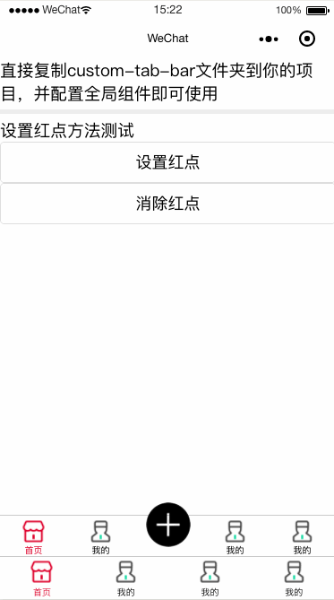

# miniprogram-custom-tab-bar

小程序自定义底部导航栏组件

* 适配iPhone X
* 无需额外配置，甚至不用传参，自动读取app.json中tabBar的配置
* 使用wx.showTabBarRedDot方法可以设置红点
* 可以自定义样式，摆脱微信限制（如borderStyle仅支持black/white的限制）
* 可以定制个性化逻辑

## 效果图



## 使用

* npm i miniprogram-custom-tab-bar
* 在tab页面注册并引入组件即可

## 如何实现预览图中 中间突出来的图标

因为组件原理是拿app.json实现的，我们可以直接在app.json的`"tabBar"`中加入如下代码,其中iconPath可以用绝对路径，也可以用网上路径

    // app.json
    "tabBar":{
        ...,
        "customNode": {
        "iconPath": "/image/x.png",
        "activeStyle": "transform: rotate(45deg);",
        "style": "transform: rotate(0deg);"
        },
        ...
    }

**组件还在开发中，如果大家需要某些功能可以提一个issue，我会考虑把它加入到组件中去**

## 二次开发

clone 本项目，之后修改src目录中的内容，目录结构基本与小程序插件模板一致，此处是[具体文档](https://github.com/wechat-miniprogram/miniprogram-custom-component)

1. 安装依赖：

```
npm i 或 yarn
```

2. 执行命令：

```
npm run dev
```

默认会在包根目录下生成 miniprogram\_dev 目录，src 中的源代码会被构建并生成到 miniprogram\_dev/components 目录下。如果需要监听文件变化动态构建，则可以执行命令：

```
npm run watch
```

> ps: 如果 minirpogram\_dev 目录下已存在小程序 demo，执行`npm run dev`则不会再将 tools 下的 demo 拷贝到此目录下。而执行`npm run watch`则会监听 tools 目录下的 demo 变动并进行拷贝。

3. 生成的 miniprogram\_dev 目录是一个小程序项目目录，以此目录作为小程序项目目录在开发者工具中打开即可查看自定义组件被使用的效果。

4. 进阶：

* 如果有额外的构建需求，可自行修改 tools 目录中的构建脚本。
* 内置支持 less、sourcemap 等功能，默认关闭。如若需要可以自行修改 tools/config.js 配置文件中相关配置。
* 内置支持多入口构建，如若需要可自行调整 tools/config.js 配置文件的 entry 字段。
* 默认开启 eslint，可自行调整规则或在 tools/config.js 中注释掉 eslint-loader 行来关闭此功能。

## 目录结构

以下为推荐使用的目录结构，如果有必要开发者也可以自行做一些调整:

```
|--miniprogram_dev // 开发环境构建目录
|--miniprogram_dist // 生产环境构建目录
|--src // 源码
|   |--components // 通用自定义组件
|   |--images // 图片资源
|   |
|   |--xxx.js/xxx.wxml/xxx.json/xxx.wxss // 暴露的 js 模块/自定义组件入口文件
|
|--test // 测试用例
|--tools // 构建相关代码
|   |--demo // demo 小程序目录，开发环境下会被拷贝生成到 miniprogram_dev 目录中
|   |--config.js // 构建相关配置文件
|
|--gulpfile.js
```

> PS：对外暴露的 js 模块/自定义组件请放在 src 目录下，不宜放置在过深的目录。另外新增的暴露模块需要在 tools/config.js 的 entry 字段中补充，不然不会进行构建。

## 测试

* 执行测试用例：

```
npm run test
```

* 检测覆盖率：

```
npm run coverage
```

测试用例放在 test 目录下，使用 **miniprogram-simulate** 工具集进行测试，[点击此处查看](https://github.com/wechat-miniprogram/miniprogram-simulate/blob/master/README.md)使用方法。在测试中可能需要变更或调整工具集中的一些方法，可在 test/utils 下自行实现。

## 其他命令

* 清空 miniprogram_dist 目录：

```
npm run clean
```

* 清空 miniprogam_dev 目录：

```
npm run clean-dev
```
